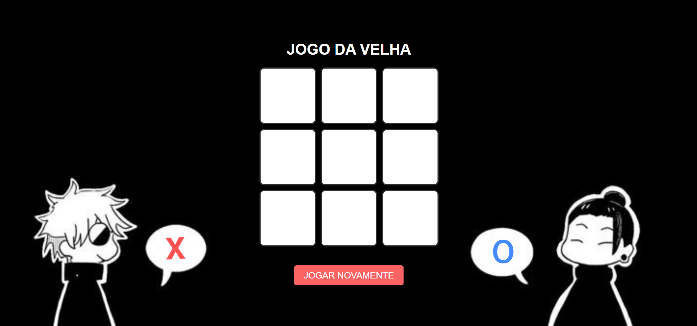

# 🎮 Jogo da Velha - Tic Tac Toe
Este é um simples Jogo da Velha (Tic Tac Toe) desenvolvido utilizando HTML, CSS e JavaScript. O jogo permite que dois jogadores joguem alternadamente, com a interface gráfica representando o tabuleiro e as marcações de "X" e "O". Além disso, é possível jogar novamente após cada rodada.

## 🔖 Índice
- [🎮 Jogo da Velha - Tic Tac Toe](#-jogo-da-velha---tic-tac-toe)
  - [🔖 Índice](#-índice)
  - [🖥️ Pré-visualização](#️-pré-visualização)
  - [🔧 Como Rodar o Projeto](#-como-rodar-o-projeto)
  - [🕹️ Como Jogar](#️-como-jogar)
  - [🚀 Tecnologias Utilizadas](#-tecnologias-utilizadas)
  - [📜 Melhorias Futuras](#-melhorias-futuras)
  - [👩‍💻 Desenvolvedora](#-desenvolvedora)

## 🖥️ Pré-visualização


## 🔧 Como Rodar o Projeto
1. Clone o repositório ou faça o download dos arquivos:
```bash
git clone git@github.com:deboradls/jogodavelha.git
```
2. Abra o arquivo index.html no navegador:
   - Você pode abrir diretamente o arquivo clicando duas vezes sobre ele, ou através de um servidor local para desenvolvimento, como o Live Server do VSCode.

## 🕹️ Como Jogar
1. Início do jogo:

   - O jogo começa com o jogador "X" sempre iniciando.
   - O tabuleiro de 3x3 é exibido na tela com 9 células clicáveis.
  
2. Turnos:
   - O jogador "X" clica em uma célula vazia para marcar sua jogada.
   - Após o jogador "X" realizar a jogada, é a vez do jogador "O" fazer o mesmo.
   - O jogo alterna entre "X" e "O" até que um jogador vença ou ocorra um empate.

3. Vencendo o jogo:
 - Um jogador vence se conseguir formar uma linha de três símbolos iguais ("X" ou "O") em uma das seguintes combinações:
   - Horizontal: 3 símbolos seguidos na mesma linha.
   - Vertical: 3 símbolos seguidos na mesma coluna.
   - Diagonal: 3 símbolos seguidos em uma das diagonais.

4. Empate:
   - Se todas as 9 células forem preenchidas e nenhum jogador conseguir formar uma linha, o jogo termina em empate.
5. Reiniciar o jogo:
   - Após uma vitória ou empate, o botão "JOGAR NOVAMENTE" aparece na tela.
   - Clique no botão para reiniciar o jogo e começar uma nova rodada.

## 🚀 Tecnologias Utilizadas
- HTML5: Estrutura do jogo.
- CSS3: Estilização do layout, incluindo a imagem de fundo e o design responsivo.
- JavaScript: Lógica do jogo (controle de turnos, verificação de vitória e empate).

## 📜 Melhorias Futuras
- Adicionar uma opção para jogar contra o computador.
- Implementar animações para a transição entre os turnos.
- Melhorar a responsividade para dispositivos móveis.
- Implementar um histórico que mostra o resultado das últimas partidas jogadas.
- Adicionar efeitos sonoros para interações no jogo, como sons de clique ou som de vitória/empate. 

## 👩‍💻 Desenvolvedora
Este Jogo da Velha foi criado como um projeto pessoal de estudo por Débora Lima, com o objetivo de aprofundar conhecimentos em HTML, CSS e JavaScript.